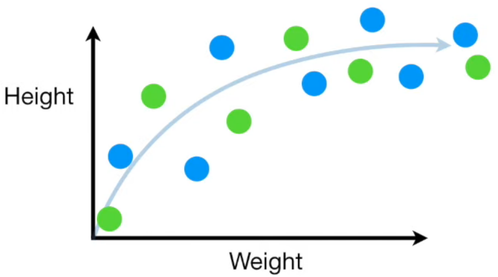
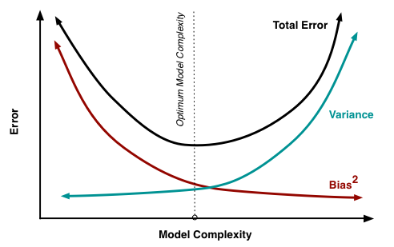
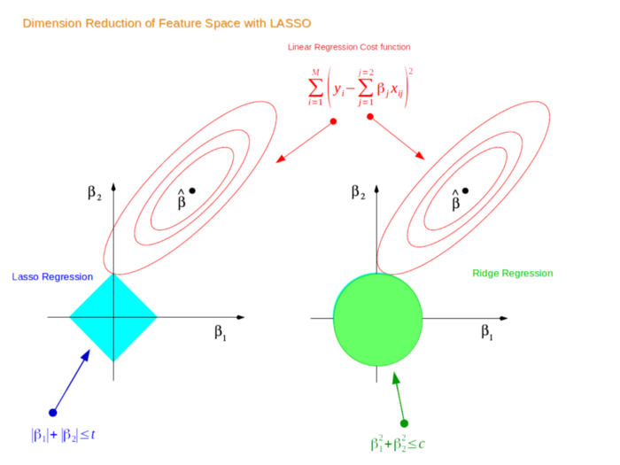

# Lecture 3 

See from last course :  
* https://www.overleaf.com/project/5d7e2078afc6970001c2b971
* https://www.overleaf.com/project/5d8104704634f500017116f0

  
  
  
  
 Model Complexity ~ Liberty of parameters
  

  
Idealised cases  
 

